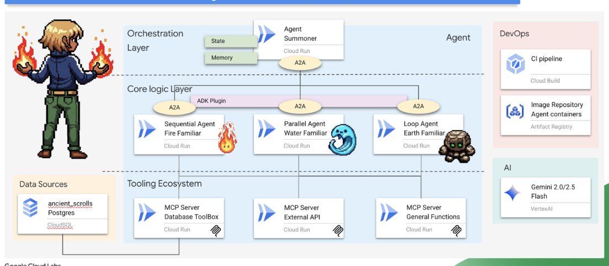

# Agentverse — The Summoner's Concord

A multi-agent AI  Google's **ADK (Agent Development Kit)**, **A2A (Agent-to-Agent) Protocol**, **MCP (Model Context Protocol)**, and a turn-based RPG dungeon crawler game — all running serverlessly on **Google Cloud**.

---

## Table of Contents

- [Project Overview](#project-overview)
- [Architecture Diagram](#architecture-diagram)
- [Repository Structure](#repository-structure)
- [Part 1: agentverse-agents-a2a](#part-1-agentverse-agents-a2a)
  - [Setup & Initialization](#setup--initialization)
  - [Elemental Familiar Agents](#elemental-familiar-agents)
  - [MCP Servers (Tool Providers)](#mcp-servers-tool-providers)
  - [Cooldown System](#cooldown-system)
  - [Cloud Build & Deployment](#cloud-build--deployment)
- [Part 2: agentverse-ui-api-dungeon](#part-2-agentverse-ui-api-dungeon)
  - [Backend (FastAPI)](#backend-fastapi)
  - [Frontend (React)](#frontend-react)
  - [Game Mechanics](#game-mechanics)
  - [Agent Integration in Combat](#agent-integration-in-combat)
- [Complete Game Loop](#complete-game-loop)
- [Google Cloud Services](#google-cloud-services)
- [A2A Protocol Explained](#a2a-protocol-explained)
- [How to Run](#how-to-run)

---

## Project Overview

The project consists of **two interconnected projects**:

| Project | Purpose |
|---------|---------|
| **agentverse-agents-a2a** | Multi-agent backend — 4 AI familiars (Fire, Water, Earth, Summoner) deployed as independent Cloud Run services communicating via A2A, with MCP servers providing tools |
| **agentverse-ui-api-dungeon** | Turn-based RPG game — React frontend + FastAPI backend where players fight bosses using their AI agents' abilities, with quiz-based damage mechanics |

**Core Technologies:**
- **Google ADK** — Agent orchestration framework (LlmAgent, SequentialAgent, ParallelAgent, LoopAgent)
- **A2A Protocol** — Inter-agent communication via `.well-known/agent.json` cards and RPC endpoints
- **MCP (Model Context Protocol)** — Standardized tool exposure via SSE transport
- **Gemini 2.5 Flash** — LLM backbone via Vertex AI
- **Cloud Run** — Serverless deployment for all services
- **Cloud SQL (PostgreSQL)** — Ability database ("Librarium of Knowledge")

---

## Architecture Diagram

```
┌─────────────────────────────────────────────────────────────────────┐
│                      agentverse-ui-api-dungeon                             │
│  ┌──────────────┐    ┌──────────────────────────────────────────┐  │
│  │  React App   │───▶│  FastAPI Backend (/api)                  │  │
│  │  - HomePage  │    │  - /miniboss/start   - /ultimateboss     │  │
│  │  - Combat    │    │  - /game/{id}        - /game/{id}/action │  │
│  │  - Quizzes   │    │                                          │  │
│  └──────────────┘    │  HeroicScribeAgent (parses agent output) │  │
│                      └────────────────┬─────────────────────────┘  │
└───────────────────────────────────────┼─────────────────────────────┘
                                        │ A2A Protocol
                                        ▼
┌─────────────────────────────────────────────────────────────────────┐
│                     agentverse-agents-a2a                            │
│                                                                     │
│  ┌─────────────────────────────────────────────────────────────┐   │
│  │              Summoner Agent (Orchestrator)                   │   │
│  │  LlmAgent + RemoteA2aAgent sub-agents                       │   │
│  │  Analyzes boss weakness → selects best familiar              │   │
│  └───────┬──────────────┬──────────────┬───────────────────────┘   │
│          │ A2A          │ A2A          │ A2A                        │
│          ▼              ▼              ▼                            │
│  ┌──────────────┐ ┌──────────┐ ┌──────────────┐                   │
│  │ Fire Familiar│ │  Water   │ │ Earth Familiar│                   │
│  │ Sequential:  │ │ Parallel:│ │ Loop (2x):    │                   │
│  │ scout→amplify│ │ 3 spells │ │ charge→check  │                   │
│  └──────┬───────┘ └────┬─────┘ └──────┬────────┘                  │
│         │              │              │                             │
│         ▼              ▼              ▼                             │
│  ┌──────────────────────────────────────────────┐                  │
│  │           MCP Servers (Tool Providers)        │                  │
│  │  general-tools-mcp: inferno_resonance,        │                  │
│  │    leviathan_surge, seismic_charge             │                  │
│  │  api-tools-mcp: cryosea_shatter,              │                  │
│  │    moonlit_cascade                             │                  │
│  └──────────────────────────────────────────────┘                  │
│              │                                                      │
│              ▼                                                      │
│  ┌───────────────────┐  ┌──────────────────────┐                   │
│  │ Nexus of Whispers │  │ Cloud SQL (Librarium) │                  │
│  │ Cooldown API +    │  │ abilities table       │                  │
│  │ External spells   │  │ (familiar, dmg, elem) │                  │
│  └───────────────────┘  └──────────────────────┘                   │
└─────────────────────────────────────────────────────────────────────┘
```

---

## Repository Structure

```
Google_A2A_exp/
├── README.md                          ← You are here
│
├── agentverse-agents-a2a/              ← Multi-agent backend
│   ├── init.sh                        # GCP project creation + billing
│   ├── set_env.sh                     # Environment variable definitions
│   ├── prepare.sh                     # Cloud SQL + fake API provisioning
│   ├── data_setup.sh                  # Database population
│   ├── billing-enablement.py          # Billing account linker
│   │
│   ├── agent/                         # Agent implementations
│   │   ├── agent_to_a2a.py            # A2A wrapper (exposes agent as A2A service)
│   │   ├── cooldown_plugin.py         # Shared cooldown plugin
│   │   ├── cloudbuild.yaml            # Deploys fire/water/earth to Cloud Run
│   │   ├── cloudbuild-summoner.yaml   # Deploys summoner to Cloud Run
│   │   ├── Dockerfile
│   │   ├── requirements.txt
│   │   ├── earth/agent.py             # LoopAgent: seismic charge accumulator
│   │   ├── fire/agent.py              # SequentialAgent: DB scout → amplifier
│   │   ├── water/agent.py             # ParallelAgent: 3-spell fan-out → merge
│   │   └── summoner/agent.py          # LlmAgent: orchestrator with RemoteA2aAgents
│   │
│   ├── mcp-servers/                   # MCP tool servers
│   │   ├── cloudbuild.yaml            # Deploys MCP servers to Cloud Run
│   │   ├── api/main.py                # cryosea_shatter, moonlit_cascade
│   │   ├── general/main.py            # inferno_resonance, leviathan_surge, seismic_charge
│   │   ├── db-toolbox/tools.yaml      # Cloud SQL ability queries (YAML-based)
│   │   └── diagnose/agent.py          # Master agent combining DB + spell tools
│   │
│   └── prerequisite/
│       ├── fake_api/fake_api_server.py # Nexus of Whispers: cooldown + spell APIs
│       └── db_setup.py                # Populates abilities table in Cloud SQL
│
└── agentverse-ui-api-dungeon/                ← RPG game application
    ├── Dockerfile                     # Multi-stage: React build + Python backend
    ├── cloudbuild.yaml                # Cloud Build deployment
    ├── start.sh                       # Entrypoint: uvicorn on port 8000
    ├── designdoc.md                   # Full application design specification
    ├── spec.md                        # Game design spec
    ├── balance.md                     # Combat balance tuning numbers
    │
    ├── backend/
    │   ├── requirements.txt
    │   └── app/
    │       ├── main.py                # FastAPI app + CORS + static files
    │       ├── api.py                 # Game endpoints (start, action, state)
    │       ├── crud.py                # Game logic, boss attacks, A2A agent calls
    │       ├── models.py              # Pydantic models (GameState, Player, Boss, Quiz)
    │       ├── single_agent.py        # HeroicScribeAgent—wraps RemoteA2aAgent
    │       ├── guardian_quizzes.py     # 20 GCP infrastructure quizzes
    │       ├── scholar_quizzes.py      # 20 RAG/data pipeline quizzes
    │       ├── shadowblade_quizzes.py  # 17 Gemini CLI/MCP/ADK quizzes
    │       └── summoner_quizzes.py     # 20 A2A protocol/agent quizzes
    │
    └── frontend/
        ├── package.json
        ├── public/assets/images/      # Boss & player sprites, attack effects
        └── src/
            ├── App.js                 # Router + global state management
            ├── styles.css             # Combat animations & layout
            ├── pages/
            │   ├── HomePage.js        # Main menu
            │   ├── MiniBossPage.js    # Single-player boss setup
            │   └── UltimateBossPage.js# 4-player ultimate boss setup
            ├── components/
            │   ├── CombatScreen.js    # Main battle loop UI
            │   ├── QuizModal.js       # Draggable quiz overlay
            │   ├── PreCombatScreen.js # Pre-fight confirmation
            │   ├── Boss.js            # Boss sprite + HP bar
            │   ├── Player.js          # Player sprite + HP bar
            │   ├── HpBar.js           # HP progress bar
            │   ├── DialogBubble.js    # Speech bubble component
            │   ├── DamageIndicator.js # Floating damage numbers
            │   ├── AttackEffect.js    # Visual attack animations
            │   ├── StatusDisplay.js   # Status message bar
            │   └── MainMenu.js        # Menu component
            └── contexts/
                └── BackgroundContext.js# Global background image state
```

---

## Part 1: agentverse-agents-a2a

### Setup & Initialization

The setup is a 4-script pipeline:

| Script | What it does |
|--------|-------------|
| `init.sh` | Creates GCP project, enables billing via `billing-enablement.py`, saves project ID to `~/project_id.txt` |
| `set_env.sh` | **Must be sourced** (`source ./set_env.sh`). Exports all env vars: `PROJECT_ID`, `REGION`, database creds, service URLs, A2A base URL |
| `prepare.sh` | Provisions Cloud SQL instance (`summoner-librarium-db`) + deploys Nexus of Whispers API to Cloud Run |
| `data_setup.sh` | Creates DB/user in Cloud SQL, runs `db_setup.py` to populate the `abilities` table |

### Elemental Familiar Agents

Each familiar is a distinct ADK agent architecture showcasing different orchestration patterns:

#### Fire Elemental — `SequentialAgent`
```
scout_agent → amplifier_agent
```
- **scout_agent**: Queries Cloud SQL via Toolbox to find fire abilities and their base damage
- **amplifier_agent**: Calls `inferno_resonance` MCP tool (base × 3) and crafts a battle narrative
- Example flow: DB lookup finds `inferno_lash` (85 dmg) → amplified to 255 damage

#### Water Elemental — `ParallelAgent` + `SequentialAgent`
```
channel_agent (parallel) → power_merger
  ├─ nexus_channeler: cryosea_shatter (80) + moonlit_cascade (105)
  └─ forge_channeler: leviathan_surge (20 × 3 = 60)
```
- Three spells execute simultaneously via ParallelAgent
- `power_merger` sums all damage values into a combined attack (e.g., 245 total)

#### Earth Elemental — `LoopAgent`
```
Loop 2x: charging_agent → check_agent
```
- **charging_agent**: Calls `seismic_charge` tool (current_energy + 2 each iteration)
- **check_agent**: Reports charge level and potential damage (energy × 80-90, cap 300)
- Iterative power buildup: 1 → 3 → 5 energy, then unleashes

#### Summoner — `LlmAgent` (Orchestrator)
```
master_summoner_agent
  ├─ RemoteA2aAgent → fire-familiar (Cloud Run)
  ├─ RemoteA2aAgent → water-familiar (Cloud Run)
  └─ RemoteA2aAgent → earth-familiar (Cloud Run)
```
- Analyzes boss weakness from description to select the best familiar
- Enforces 60-second cooldown per familiar
- Tracks `last_summon` in conversation state to avoid consecutive repeats
- Boss weakness mapping:
  - *Inescapable Reality* → Fire
  - *Revolutionary Rewrite* → Fire
  - *Elegant Sufficiency* → Earth
  - *Unbroken Collaboration* → Water

### MCP Servers (Tool Providers)

MCP servers expose tools via Server-Sent Events (SSE) at `/sse` endpoints:

| Server | Tools | Purpose |
|--------|-------|---------|
| **general-tools-mcp** | `inferno_resonance(base)` → base × 3 | Fire damage amplifier |
| | `leviathan_surge(base)` → base × 3 | Water damage amplifier |
| | `seismic_charge(energy)` → energy + 2 | Earth energy accumulator |
| **api-tools-mcp** | `cryosea_shatter()` → 80 dmg | Water external spell (calls Nexus API) |
| | `moonlit_cascade()` → 105 dmg | Water external spell (calls Nexus API) |
| **db-toolbox** (YAML) | `lookup-available-ability(familiar_name)` | SQL: SELECT abilities by familiar |
| | `ability-damage(ability_name)` | SQL: SELECT damage by ability name |

### Cooldown System

Each familiar has a **60-second cooldown** enforced via the Nexus of Whispers API:

```
Before Agent Executes:
  1. GET /cooldown/{agent_name} → returns last_used timestamp
  2. If (now - last_used) < 60 seconds → REJECT with "exhausted" message
  3. If available → POST /cooldown/{agent_name} with current timestamp
  4. Agent proceeds normally
```

Implemented as `CoolDownPlugin` (shared) or `check_cool_down` callback (per-agent), configured via `before_agent_callback` on the root agent.

### Cloud Build & Deployment

| Config | Deploys |
|--------|---------|
| `agent/cloudbuild.yaml` | `fire-familiar`, `water-familiar`, `earth-familiar` (parallel) |
| `agent/cloudbuild-summoner.yaml` | `summoner-agent` (needs familiar URLs) |
| `mcp-servers/cloudbuild.yaml` | `api-tools-mcp`, `general-tools-mcp` |
| `prerequisite/fake_api/cloudbuild.yaml` | `nexus-of-whispers-api` |

All services deploy to **Cloud Run** in `us-central1` with `min-instances=1`.

---

## Part 2: agentverse-ui-api-dungeon

### Backend (FastAPI)

**Endpoints:**

| Method | Path | Purpose |
|--------|------|---------|
| POST | `/api/miniboss/start` | Start 1-player fight (class + boss + agent URL) |
| POST | `/api/ultimateboss/start` | Start 4-player party fight (4 agent URLs) |
| GET | `/api/game/{game_id}` | Fetch game state (auto-processes boss turn) |
| POST | `/api/game/{game_id}/action` | Submit quiz answer (applies damage) |
| GET/PUT | `/api/config` | Read/update game balance settings |

**Key Backend Components:**

- **`single_agent.py`** — Creates a `SequentialAgent` per player:
  - Step 1: `RemoteA2aAgent` calls the player's deployed agent (e.g., `fire-familiar.run.app`)
  - Step 2: `HeroicScribeAgent` (Gemini 2.5 Flash) parses the narrative into `{"damage_point": int, "message": string}`

- **`crud.py`** — Game logic layer:
  - 7 mini-bosses with unique weaknesses and dialogue phrases
  - Boss attack generation with thematic messages
  - A2A agent invocation with response parsing
  - Quiz selection from class-specific question banks

- **`models.py`** — Pydantic models: `GameState`, `Player`, `Boss`, `Quiz`, `Config`

### Frontend (React)

**Routing:**
| Path | Component | Purpose |
|------|-----------|---------|
| `/` | `HomePage` | Main menu with Mini-Boss / Ultimate Boss options |
| `/mini-boss` | `MiniBossPage` | Enter A2A endpoint, auto-detect class, random boss |
| `/ultimate-boss` | `UltimateBossPage` | Enter 4 agent endpoints |
| `/pre-combat` | `PreCombatScreen` | Preview boss/player stats before fight |
| `/combat` | `CombatScreen` | Main battle loop with animations |

**CombatScreen Features:**
- Animated boss attacks (shake, pulsate, desaturate, flip effects cycling every 6 seconds)
- Boss dialogue cycling from predefined phrase lists
- Draggable `QuizModal` (via react-draggable) with 3 answer choices
- Floating damage numbers via `DamageIndicator`
- HP bars with color coding
- Game-over screen with victory/defeat message

### Game Mechanics

**Player Classes:**

| Class | HP | Role | Quiz Topics | Turns (Ultimate) |
|-------|----|------|-------------|-------------------|
| Shadowblade | 500 | DPS | Gemini CLI, MCP, ADK | 5 |
| Scholar | 450 | Mid-DPS | RAG, BigQuery, pgvector | 3 |
| Guardian | 950 | Tank | Cloud Build, Cloud Run, IAM | 2 |
| Summoner | 400 | Glass Cannon | A2A, Agent architecture | 2 |

**Mini-Bosses (7):**

| Boss | Weakness | HP Range |
|------|----------|----------|
| Procrastination | Inescapable Reality | 600-800 |
| Hype | Inescapable Reality | 600-800 |
| Dogma | Revolutionary Rewrite | 600-800 |
| Legacy | Revolutionary Rewrite | 600-800 |
| Perfectionism | Elegant Sufficiency | 600-800 |
| Obfuscation | Elegant Sufficiency | 600-800 |
| Apathy | Unbroken Collaboration | 600-800 |

**Ultimate Boss:** Mergepocalypse (3500 HP, weak to all 4 strategies)

**Combat Flow:**
1. Boss attacks (AoE in ultimate, single-target in mini)
2. Player's A2A agent generates a narrative response
3. `HeroicScribeAgent` parses response → damage value
4. Class-specific quiz appears (GCP knowledge questions)
5. Correct answer → full damage to boss; Wrong → half damage
6. Repeat until boss HP ≤ 0 (win) or player(s) HP ≤ 0 (lose)

### Agent Integration in Combat

```
Boss attacks → attack description sent to player's A2A agent
                         │
                         ▼
            ┌─────────────────────────┐
            │ RemoteA2aAgent          │
            │ (calls deployed agent)  │
            │ e.g., fire-familiar     │
            │ Returns: narrative text │
            └────────────┬────────────┘
                         │
                         ▼
            ┌─────────────────────────┐
            │ HeroicScribeAgent       │
            │ (Gemini 2.5 Flash)      │
            │ Parses → JSON:          │
            │ {damage_point, message} │
            └────────────┬────────────┘
                         │
                         ▼
            ┌─────────────────────────┐
            │ Quiz Selection          │
            │ Random class-specific   │
            │ question + agent damage │
            │ → sent to frontend      │
            └─────────────────────────┘
```

---

## Complete Game Loop

**Mini-Boss Fight Example (Shadowblade vs Procrastination):**

1. **Frontend** → User enters agent URL (`shadowblade-agent.run.app`), class auto-detected
2. **Backend** → Creates game: Boss HP 600-800, Player HP 500, turn order `[boss, player, player]`
3. **Boss Turn** → Generates attack: *"Procrastination looms... dealing 120 damage"*
4. **Player Turn** → `RemoteA2aAgent` calls Shadowblade agent → receives narrative
5. **Scribe Agent** → Parses to `{"damage_point": 95, "message": "I strike with fury!"}`
6. **Quiz** → Random Shadowblade quiz (Gemini CLI / MCP topic) with 95 damage attached
7. **User answers** → Correct: 95 damage to boss. Wrong: 47 damage. Boss HP decreases
8. **Repeat** until boss or player reaches 0 HP

**Note:** Shadowblade/Scholar get 2 consecutive player turns per cycle (`[boss, player, player]`).

---

## Google Cloud Services

| Service | Usage |
|---------|-------|
| **Cloud Run** | Hosts all agents, MCP servers, game backend, Nexus API |
| **Cloud SQL (PostgreSQL)** | `familiar_grimoire` database with abilities table |
| **Cloud Build** | CI/CD for building Docker images and deploying to Cloud Run |
| **Artifact Registry** | Docker image storage (`agentverse-repo`) |
| **Vertex AI (Gemini 2.5 Flash)** | LLM backbone for all agent reasoning |
| **Cloud IAM** | Service account permissions for agent-to-service communication |
| **Cloud Billing API** | Automated billing account linking during setup |

---

## A2A Protocol Explained

**A2A (Agent-to-Agent)** is a standardized protocol for independent agent services to communicate:

```
Agent A                                  Agent B (Cloud Run)
   │                                         │
   ├── GET /.well-known/agent.json ──────────▶│  (Agent Card: name, capabilities, RPC URL)
   │◀─────────────────────────────────────────┤
   │                                         │
   ├── POST /rpc ────────────────────────────▶│  (Send message/task)
   │   {message: "Attack the monster"}       │
   │◀─────────────────────────────────────────┤  (Response with narrative)
   │   {result: "I unleash inferno!"}        │
```

In this project:
- **`agent_to_a2a.py`** wraps any ADK agent into an A2A-compatible Starlette application
- **`RemoteA2aAgent`** (from `google-adk`) connects to remote A2A services as sub-agents
- The **Summoner** orchestrates Fire/Water/Earth via A2A
- The **Dungeon backend** calls player agents via A2A through `HeroicScribeAgent`

---

## How to Run

### Prerequisites
- Google Cloud project with billing enabled
- `gcloud` CLI authenticated
- Python 3.11+, Node.js 20+

### Setup (agentverse-agents-a2a)
```bash
cd agentverse-agents-a2a

# 1. Create GCP project and enable billing
./init.sh

# 2. Set environment variables (MUST source, not execute)
source ./set_env.sh

# 3. Provision infrastructure (Cloud SQL + Nexus API)
./prepare.sh

# 4. Populate database
./data_setup.sh

# 5. Deploy MCP servers
gcloud builds submit mcp-servers/ --config mcp-servers/cloudbuild.yaml \
  --substitutions=...

# 6. Deploy familiar agents
gcloud builds submit agent/ --config agent/cloudbuild.yaml \
  --substitutions=...

# 7. Deploy summoner (after familiars are up)
gcloud builds submit agent/ --config agent/cloudbuild-summoner.yaml \
  --substitutions=...
```

### Local Development (agentverse-ui-api-dungeon)
```bash
cd agentverse-ui-api-dungeon

# Backend
cd backend && pip install -r requirements.txt
uvicorn app.main:app --host 0.0.0.0 --port 8000

# Frontend (separate terminal)
cd frontend && npm install && npm start
```

### Local Agent Testing
```bash
cd agentverse-agents-a2a/mcp-servers
source .venv/bin/activate
# or use .venv/bin/adk directly
.venv/bin/adk run earth
```


---

## Deep Dive: How Every Piece Works Under the Hood

This section walks through the internals of each component — what the code actually does, how data flows between services, what design decisions were made, and why.

---

### ADK Agent Patterns — Why Four Different Architectures?

Each familiar deliberately showcases a different **Google ADK orchestration pattern**. This isn't cosmetic — the project is designed as a learning reference for all four core patterns:

| Pattern | Agent | ADK Class | When to Use |
|---------|-------|-----------|-------------|
| **Sequential** | Fire | `SequentialAgent` | Pipeline: output of step N feeds step N+1 |
| **Parallel + Sequential** | Water | `ParallelAgent` → `SequentialAgent` | Fan-out independent work, then merge results |
| **Loop** | Earth | `LoopAgent` | Iterative accumulation with a termination condition |
| **LLM Orchestrator** | Summoner | `LlmAgent` with sub-agents | Dynamic routing — LLM decides which sub-agent to invoke |

#### Fire Familiar — Sequential Pipeline in Detail

```python
# fire/agent.py — Two LlmAgents chained via SequentialAgent
root_agent = SequentialAgent(
    name='fire_elemental_familiar',
    sub_agents=[scout_agent, amplifier_agent],
)
```

**Step 1 — `scout_agent` (Librarian):**
- Connects to **Cloud SQL via Toolbox** (`ToolboxSyncClient`) — not MCP, but Google's Toolbox SDK
- Loads the `summoner-librarium` toolset which exposes two SQL queries:
  - `lookup-available-ability(familiar_name)` → `SELECT ability_name, damage_points FROM abilities WHERE familiar_name = $1`
  - `ability-damage(ability_name)` → `SELECT damage_points FROM abilities WHERE ability_name = $1`
- The LLM calls these tools to discover Fire Elemental abilities (e.g., `inferno_lash` at 85 damage, `emberstorm` at 90, `Pyroclasm` at 80)
- It randomly picks one and retrieves the base damage

**Step 2 — `amplifier_agent`:**
- Receives the scout's output (base damage number) as context from the previous step
- Calls `inferno_resonance` via the **general-tools MCP server** over SSE
- The MCP tool multiplies: `base_fire_damage × 3` → e.g., 85 × 3 = 255
- The LLM then crafts an epic battle narrative around that final number

**Key insight:** The `SequentialAgent` automatically passes the output of `scout_agent` as input context to `amplifier_agent`. No explicit message passing needed — ADK handles the session state threading.

#### Water Familiar — Parallel Fan-Out + Merge

```python
# water/agent.py — ParallelAgent feeds into a merger via SequentialAgent
channel_agent = ParallelAgent(
    name='channel_agent',
    sub_agents=[nexus_channeler, forge_channeler],
)

root_agent = SequentialAgent(
    name="water_elemental_familiar",
    sub_agents=[channel_agent, power_merger],
)
```

**Fan-out phase (`ParallelAgent`):**
Two LlmAgents run **simultaneously**:
1. `nexus_channeler` → calls two MCP tools from the **api-tools-mcp** server:
   - `cryosea_shatter()` → HTTP POST to Nexus of Whispers API → returns 80 damage
   - `moonlit_cascade()` → HTTP POST to Nexus of Whispers API → returns 105 damage
2. `forge_channeler` → calls `leviathan_surge(base_water_damage=20)` from **general-tools-mcp** → 20 × 3 = 60

**Merge phase (`power_merger`):**
- Receives concatenated outputs from both parallel agents
- Instructed to extract all damage numbers, sum them (80 + 105 + 60 = 245)
- Creates an epic combined water/ice attack description

**Key insight:** The `ParallelAgent` truly runs sub-agents concurrently — both MCP tool calls happen at the same time, reducing total latency.

#### Earth Familiar — Loop with Accumulation

```python
# earth/agent.py — LoopAgent iterates charging_agent → check_agent
root_agent = LoopAgent(
    name="earth_elemental_familiar",
    sub_agents=[charging_agent, check_agent],
    max_iterations=2,
    before_agent_callback=check_cool_down  # Cooldown enforced HERE
)
```

**Iteration 1:**
- `charging_agent` calls `seismic_charge(current_energy=1)` → returns energy = 3
- `check_agent` reports: energy is 3, potential damage = 3 × (80-90) ≈ 240-270

**Iteration 2:**
- `charging_agent` calls `seismic_charge(current_energy=3)` → returns energy = 5
- `check_agent` unleashes: energy × multiplier, capped at 300

**Key insight:** Earth is the only agent that uses `before_agent_callback` directly on the root agent (via `check_cool_down` function), while Fire and Water rely on the `CoolDownPlugin` injected at the A2A wrapper level. This shows two different ways to enforce pre-execution logic in ADK.

#### Summoner — LLM as Dynamic Router

```python
# summoner/agent.py — LlmAgent decides which familiar to invoke
root_agent = LlmAgent(
    name="orchestrater_agent",
    model="gemini-2.5-flash",
    instruction="... analyze monster weakness → select best familiar ...",
    sub_agents=[fire_familiar, water_familiar, earth_familiar],
    after_tool_callback=save_last_summon_after_tool,
)
```

**How the routing works:**
1. The LLM receives a boss description (e.g., "Procrastination looms...")
2. It matches the weakness keyword to its doctrine:
   - *Inescapable Reality* → Fire, *Unbroken Collaboration* → Water, *Elegant Sufficiency* → Earth
3. It checks `state["last_summon"]` to avoid calling the same familiar twice consecutively
4. It invokes the chosen familiar as a **`RemoteA2aAgent`** → HTTP to a separate Cloud Run service

**The `after_tool_callback` trick:**
```python
def save_last_summon_after_tool(tool, args, tool_context, tool_response):
    tool_context.state["last_summon"] = tool.name  # Persists across conversation turns
    return tool_response
```
This callback fires after every tool/sub-agent execution, recording which familiar was last called so the LLM can enforce diversity.

**Key insight:** The `RemoteA2aAgent` sub-agents fetch their capabilities from `/.well-known/agent.json` at startup. The Summoner doesn't know Fire's internal implementation — it only knows the A2A card's description and capabilities.

---

### The A2A Wrapper — `agent_to_a2a.py` Internals

This is the bridge that turns any ADK agent into a standalone A2A-compatible HTTP service:

```python
def to_a2a(agent, *, host="0.0.0.0", port=8080, public_url=None) -> Starlette:
```

**What it creates:**

1. **`Runner`** — ADK's execution engine with in-memory services:
   - `InMemorySessionService` — conversation history per session
   - `InMemoryArtifactService` — file/blob storage (unused here)
   - `InMemoryMemoryService` — long-term memory (unused here)
   - `InMemoryCredentialService` — auth token storage
   - **`CoolDownPlugin`** — injected as a plugin with 60-second cooldown

2. **`A2aAgentExecutor`** — Bridges ADK Runner ↔ A2A protocol

3. **`AgentCardBuilder`** — Generates the `/.well-known/agent.json` card containing:
   - Agent name and description (pulled from the ADK agent definition)
   - RPC URL (the `public_url` — a Cloud Run URL)
   - Supported capabilities

4. **`A2AStarletteApplication`** — Mounts routes on a Starlette app:
   - `GET /.well-known/agent.json` → agent card
   - `POST /` → JSON-RPC endpoint for task submission

**Startup flow:**
```
Starlette app created → "startup" event fires → AgentCardBuilder.build() runs async
→ A2A routes mounted → Server ready to accept RPC calls
```

---

### MCP Server Architecture — Two Different Tool Strategies

The project demonstrates two MCP server patterns:

#### Pattern 1: Pure Computation (general-tools-mcp)
```python
# mcp-servers/general/main.py
def inferno_resonance(base_fire_damage: int) -> str:
    return f"...charged to deal {base_fire_damage * 3} damage."

# Wrapped as ADK FunctionTool, then converted to MCP schema
inferno_resonanceTool = FunctionTool(inferno_resonance)
schema = adk_to_mcp_tool_type(inferno_resonanceTool)  # ADK → MCP conversion
```

Tools are plain Python functions wrapped in `FunctionTool`, then exposed via MCP's low-level `Server` with SSE transport. The `adk_to_mcp_tool_type` conversion utility handles schema translation (parameter types, descriptions → JSON Schema).

#### Pattern 2: External API Proxy (api-tools-mcp)
```python
# mcp-servers/api/main.py
def cryosea_shatter() -> str:
    response = requests.post(f"{API_SERVER_URL}/cryosea_shatter")
    data = response.json()
    return f"...dealing {data.get('damage_points')} damage."
```

These MCP tools are **proxies** — they make HTTP calls to the Nexus of Whispers API (a FastAPI service on Cloud Run) and wrap the response in a thematic message.

#### Pattern 3: YAML-Defined SQL Tools (db-toolbox)
```yaml
# mcp-servers/db-toolbox/tools.yaml
tools:
  lookup-available-ability:
    kind: postgres-sql
    source: summoner-librarium
    statement: |
      SELECT ability_name, damage_points FROM abilities WHERE familiar_name = $1;
```

Google's Toolbox runtime reads this YAML and auto-generates a REST API that ADK agents consume via `ToolboxSyncClient`. No Python code needed — the tools are pure SQL declarations with typed parameters.

#### SSE Transport Pattern (shared by both MCP servers)
```python
app = Server("Arcane-Forge")
sse = SseServerTransport("/messages/")

starlette_app = Starlette(routes=[
    Route("/sse", endpoint=handle_sse),          # SSE connection endpoint
    Mount("/messages/", app=sse.handle_post_message),  # Message posting endpoint
])
```

Agents connect to `/sse` to establish a Server-Sent Events stream. Tool calls are sent as POST to `/messages/`. This is MCP's standard SSE transport for remote servers.

---

### The Cooldown System — Two Implementations Compared

The project shows **two different** ways to enforce cooldowns in ADK:

#### Implementation 1: `before_agent_callback` (Earth only)
```python
# earth/agent.py — Callback function directly on the agent
def check_cool_down(callback_context: CallbackContext) -> Optional[types.Content]:
    response = requests.get(f"{COOLDOWN_API_URL}/cooldown/{agent_name}")
    # If on cooldown → return Content (terminates agent)
    # If available → POST new timestamp, return None (proceeds normally)

root_agent = LoopAgent(..., before_agent_callback=check_cool_down)
```

**Behavior:** The callback fires before the `LoopAgent` starts ANY iteration. If the agent was used within 60 seconds, it returns a `Content` object that completely replaces the agent's output.

#### Implementation 2: `CoolDownPlugin` (Fire, Water via A2A wrapper)
```python
# cooldown_plugin.py — ADK Plugin injected into the Runner
class CoolDownPlugin(BasePlugin):
    async def before_agent_callback(self, *, agent, callback_context):
        if not agent_name.endswith("_elemental_familiar"):
            return None  # Skip sub-agents!
        # Same cooldown check logic as above...
```

**Critical difference:** The plugin runs for **every** agent in the tree (root + sub-agents). It has a guard clause: `if not agent_name.endswith("_elemental_familiar")` — this prevents intermediate agents like `scout_agent` or `amplifier_agent` from triggering cooldown checks. Only the root familiar agent is gated.

#### The Nexus of Whispers API (Cooldown Backend)
```python
# prerequisite/fake_api/fake_api_server.py
cooldown_db = {}  # In-memory dict: {"familiar_name": "ISO_timestamp"}

@app.get("/cooldown/{familiar_name}")
def get_cooldown_status(familiar_name):
    return {"time": cooldown_db.get(familiar_name)}

@app.post("/cooldown/{familiar_name}")
def set_cooldown_timestamp(familiar_name, request):
    cooldown_db[familiar_name] = request.timestamp
```

Simple in-memory storage. The cooldown state resets when the service restarts. In production, this would be backed by Redis or Firestore.

---

### The Dungeon Backend — How Combat Actually Works

#### Game Initialization Flow

```
POST /api/miniboss/start
  │
  ├─ Validate player_class, get HP from config
  ├─ create_heroic_action_agent(a2a_endpoint) → InMemoryRunner
  │     └─ SequentialAgent[RemoteA2aAgent → HeroicScribeAgent]
  ├─ Create Player model with runner + session_id
  ├─ If Guardian → asyncio.create_task(trigger_guardian_agent)  ← pre-fight prep call
  ├─ Build turn_order:
  │     Shadowblade/Scholar: ["boss", "player_1", "player_1"]  ← 2 attacks per cycle
  │     Guardian/Summoner:   ["boss", "player_1"]               ← 1 attack per cycle
  └─ Return GameState JSON
```

**The Guardian pre-trigger:** When a Guardian is selected, the backend immediately fires a background A2A call ("A monster is coming, be prepared") so the agent's first real response is faster (the LLM context is pre-warmed).

#### Combat Turn Cycle in Detail

```
GET /api/game/{game_id}  (current_turn == "boss")
  │
  ├─ Boss attacks:
  │   Mini: Single target, 110-140 damage (1/8 chance for half)
  │   Ultimate: AoE with class-specific damage ranges
  │     Guardian: 110-170  │  Scholar: 40-80
  │     Shadowblade: 60-120  │  Summoner: 70-100
  │
  ├─ advance_turn() → current_turn = "player_1"
  │
  ├─ Call player's A2A agent:
  │   mock_player_a2a_agent(boss_attack_msg, runner, player_id, session_id, class)
  │     │
  │     ├─ If Summoner: await asyncio.sleep(30)  ← deliberate delay for summoner cooldown
  │     ├─ process_player_action(runner, boss_attack, user_id, session_id)
  │     │     │
  │     │     ├─ RemoteA2aAgent → calls player's deployed agent → narrative text
  │     │     └─ HeroicScribeAgent → parses narrative → {"damage_point": 250, "message": "..."}
  │     │
  │     └─ If damage == 0 → fallback damage by class ← handles rate limits gracefully
  │
  ├─ mock_damage_quiz_agent() → picks random class quiz + attaches damage value
  └─ Return GameState with active_quiz
```

```
POST /api/game/{game_id}/action  {answer_index: 1}
  │
  ├─ Correct answer → full damage to boss
  ├─ Wrong answer → damage // 2  (integer division = half)
  ├─ boss.hp = max(0, boss.hp - damage)
  ├─ check_game_over()
  ├─ advance_turn()
  │
  ├─ If next turn is another player:
  │     └─ Immediately call their A2A agent + generate quiz
  ├─ If next turn is boss:
  │     └─ Return state (frontend polls GET /game/{id} to trigger boss turn)
  └─ Return GameState
```

#### The HeroicScribeAgent — LLM-as-Parser

This is one of the cleverest patterns in the project:

```python
scribe_agent = LlmAgent(
    model="gemini-2.5-flash",
    name="HeroicScribeAgent",
    instruction="""
        Your final output MUST BE ONLY the raw JSON object:
        {"damage_point": int, "message": string}
        Convert words like "ninety" to 90.
    """,
)
```

Instead of writing regex or a custom parser to extract damage numbers from narrative text, the project uses Gemini as a **structured data extractor**. The `RemoteA2aAgent` returns free-text like *"I channel the amplified energy... unleashing a SUPERNOVA for 255 damage!"* and the Scribe converts it to `{"damage_point": 255, "message": "..."}`.

The JSON is cleaned with:
```python
cleaned_output = final_output.strip().replace('```json', '').replace('```', '').strip()
data = json.loads(cleaned_output)
```

---

### Frontend Combat Engine — Animation & State Machine

#### The Combat Loop State Machine

```
BOSS_TURN                          PLAYER_TURN
   │                                  │
   ├─ setStatusMessage("Waiting...")  ├─ showQuiz = true
   ├─ wait(4000ms)                    │
   ├─ pollGameState() ← GET /game/id │
   ├─ setBossDialog(attack_msg)       │
   ├─ wait(8000ms) ← dialog display  │
   ├─ setBossDialog(null)             │
   ├─ If game_over → GameOverScreen   │
   └─ showQuiz = true                 │
                                      │
       USER ANSWERS QUIZ              │
              │                       │
              ├─ showQuiz = false     │
              ├─ onAction() ← POST   │
              ├─ setPlayerDialog()    │
              ├─ wait(3000ms)         │
              └─ setPlayerDialog(null)│
```

#### Boss Animation System
```javascript
const animationEffects = ['effect-shake', 'effect-pulsate-glow', 'effect-desaturate', 'effect-flip-and-shake'];

// Cycles every 6 seconds during the acting character's turn
useEffect(() => {
    intervalId = setInterval(() => {
        setCurrentEffect(animationEffects[effectIndex]);
        effectIndex = (effectIndex + 1) % animationEffects.length;
    }, 6000);
}, [actingCharacter]);
```

Four CSS animation effects cycle on the active character's sprite, creating visual feedback while the backend processes A2A calls.

#### Boss Dialogue Cycling
During the boss turn, a second `useEffect` cycles through the boss's predefined dialogue phrases (stored in `BOSS_DIALOGUES` — 14-15 phrases per boss) every 6 seconds. This keeps the UI alive during the AI processing delay.

#### The Draggable Quiz Modal
```jsx
<Draggable nodeRef={nodeRef} handle=".quiz-modal-handle">
    <div ref={nodeRef} className="quiz-modal-overlay">
        <div className="quiz-modal-handle">Drag from here</div>
        // ... quiz content
    </div>
</Draggable>
```
The quiz uses `react-draggable` so players can move it around the screen to see the boss/player sprites behind it during combat.

---

### Cloud SQL Database Schema — The Librarium

```sql
CREATE TABLE abilities (
    id SERIAL PRIMARY KEY,
    familiar_name VARCHAR(50) NOT NULL,
    ability_name VARCHAR(50) UNIQUE NOT NULL,
    damage_points INTEGER NOT NULL,
    element VARCHAR(20) NOT NULL
);
```

Populated with:
| familiar_name | ability_name | damage_points | element |
|---------------|-------------|---------------|---------|
| Fire Elemental | inferno_lash | 85 | Fire |
| Fire Elemental | emberstorm | 90 | Fire |
| Fire Elemental | Pyroclasm | 80 | Fire |

Only Fire has DB-stored abilities. Water and Earth use computed values from MCP tools. This is intentional — it demonstrates the difference between **data-backed tools** (SQL queries) and **computation-backed tools** (pure functions, API calls).

---

### Infrastructure Deep Dive

#### Docker Strategy — One Image, Three Services

```dockerfile
# agent/Dockerfile — same base for all familiars
FROM python:3.12-slim
COPY . /app
CMD ["python", "-m", "earth.agent"]  # Default, overridden per deployment
```

Cloud Build compiles a single Docker image (`base-familiar:latest`), then deploys it three times with different `--command` overrides:
```yaml
# cloudbuild.yaml — parallel deployment
deploy-fire-familiar:   --args=-m,fire.agent
deploy-water-familiar:  --args=-m,water.agent
deploy-earth-familiar:  --args=-m,earth.agent
```

This is efficient: one build step → three deployments. The `PYTHONPATH=/app` env var ensures all module imports work regardless of which agent is the entrypoint.

#### Multi-Stage Build for the Dungeon UI
```dockerfile
# Stage 1: Build React → static files
FROM node:20-alpine AS builder
RUN npm run build

# Stage 2: Python backend serves the static files
FROM python:3.12-slim
COPY --from=builder /app/frontend/build ./frontend/build
```

The React app is pre-built and served as static files by FastAPI's `StaticFiles` middleware — no Node.js runtime needed in production.

#### Environment Variable Flow

```
init.sh → saves PROJECT_ID to ~/project_id.txt
     ↓
set_env.sh → reads file → exports:
  PROJECT_ID, PROJECT_NUMBER, SERVICE_ACCOUNT_NAME
  REGION (us-central1), DB config, API URLs
  FIRE_URL, WATER_URL, EARTH_URL (from gcloud run describe)
     ↓
prepare.sh → sources set_env.sh → creates Cloud SQL + deploys Nexus API
     ↓
data_setup.sh → sources set_env.sh → creates DB/user + populates abilities table
     ↓
cloudbuild.yaml → receives vars as _SUBSTITUTIONS → injects as --set-env-vars
     ↓
Cloud Run containers → read env vars at runtime (os.environ.get)
```

---

### Battle Balance Deep Dive

#### Damage Economy Per Class

| Class | Avg Damage/Turn | Turns/Cycle | Effective DPS/Cycle | HP | Survival vs Boss (110-140/hit) |
|-------|----------------|-------------|---------------------|----|-------------------------------|
| Summoner | 210-250 | 1 | ~230 | 400 | ~3 boss hits |
| Shadowblade | 110-160 | 2 | ~270 | 500 | ~4 boss hits |
| Scholar | 125-150 | 2 | ~275 | 450 | ~3.5 boss hits |
| Guardian | 120-150 | 1 | ~135 | 950 | ~7.5 boss hits |

**Design philosophy:** Shadowblade and Scholar get **2 consecutive turns** per boss attack, making them feel fast. Guardian gets only 1 turn but can survive far longer. Summoner hits hardest per turn but is a glass cannon.

#### The Rate Limit Fallback
```python
if dmg == 0:
    if player_class == "Summoner":
        dmg = random.randint(210, 250)
    elif player_class == "Shadowblade":
        dmg = random.randint(110, 160)
```

If the A2A agent returns 0 damage (Gemini rate limit, network error, or parse failure), the backend generates fallback damage appropriate to the class. The game never stalls — it degrades gracefully.

#### The Summoner 30-Second Delay
```python
if player_class == "Summoner":
    await asyncio.sleep(30)
    msg, dmg = await process_player_action(...)
```

The Summoner class deliberately waits 30 seconds before calling its agent. This accounts for the cascading A2A calls: Summoner → (selects familiar) → Fire/Water/Earth → MCP tools. The delay ensures the familiar's cooldown has passed if it was recently used.

---

### Quiz System — GCP Knowledge Testing

Each player class has a curated set of **GCP/AI quiz questions**:

| Class | Quiz File | Topics | # Questions |
|-------|-----------|--------|-------------|
| Shadowblade | `shadowblade_quizzes.py` | Gemini CLI, MCP protocol, ADK usage | 17 |
| Scholar | `scholar_quizzes.py` | RAG patterns, BigQuery, pgvector, data pipelines | 20 |
| Guardian | `guardian_quizzes.py` | Cloud Build, Cloud Run, IAM, infrastructure | 20 |
| Summoner | `summoner_quizzes.py` | A2A protocol, agent architecture, multi-agent design | 20 |

**Quiz selection is random** — `random.choice(questions)` from the class pool. The quiz carries the damage value from the A2A agent:
- **Correct answer** → full damage applied to boss
- **Wrong answer** → `damage // 2` (integer division, always rounds down)

This creates a learning incentive: players who know GCP well deal **2× more effective damage** per turn.

---

### The Diagnose Agent — Hidden Master Agent

There's a standalone diagnostic agent in `mcp-servers/diagnose/agent.py` that isn't used in the game but serves as a testing tool:

```python
root_agent = LlmAgent(
    name='master_summoner_agent',
    instruction="Delegate knowledge queries to librarian_agent, 
                 and casting/accumulation to arcane_battlemage_agent",
    sub_agents=[db_agent, mcp_agent],
)
```

This agent combines **all** tool sources (DB Toolbox + both MCP servers) under one LLM router. It's useful for verifying that all MCP servers and the database are working before deploying the familiars.

---

### Key Design Decisions & Trade-offs

| Decision | Why | Trade-off |
|----------|-----|-----------|
| In-memory game state (`game_db = {}`) | Simplicity, no database dependency for the UI | Games lost on server restart |
| In-memory cooldown storage | Fast, no external dependency | Cooldowns reset on API restart |
| `InMemoryRunner` per player | Isolated session per player in a game | Memory grows with concurrent games |
| Single Docker image for 3 familiars | Build once, deploy thrice — faster CI/CD | Larger image than needed per service |
| LLM-as-parser (HeroicScribeAgent) | Handles diverse narrative formats without regex | LLM costs per parse, potential hallucination |
| 30s sleep for Summoner class | Simple fix for cascading cooldowns | Adds latency; could be event-driven |
| `min-instances=1` on Cloud Run | Eliminates cold starts for agent services | Higher cost even when idle |
| `GOOGLE_GENAI_USE_VERTEXAI=TRUE` | Routes Gemini calls through Vertex AI (not AI Studio) | Requires GCP project with billing |

---

# Reference docs

https://codelabs.developers.google.com/agentverse-architect/instructions?hl=en#3


